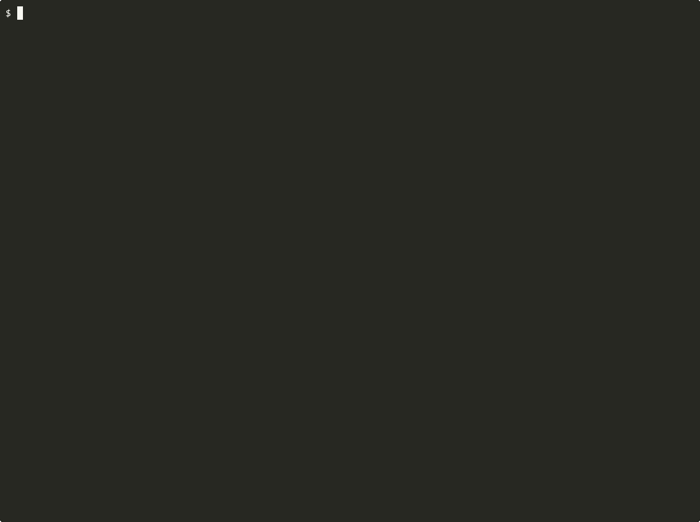

# NREKI - Bulletproof Shield for AI Coding Agents

<p align="center">
  
  
  
  
  
  
</p>

**MCP plugin that validates AI agent edits in RAM before they touch disk.** When Claude Code, Cursor, or Copilot changes a function signature in one file and breaks 30 others, NREKI catches it in milliseconds - the file is never written. If the error is structural (missing import, forgotten `await`), NREKI auto-fixes it in RAM. Zero tokens wasted on fix-retry doom loops.

**v10.7 - The NREKI Way.** Parasitic signals now ride inside `outline`: a defect radar flags LLM-rush patterns (`⚠️ [empty catch, any escape]`), a ghost oracle tags unreferenced exports (`👻 [0 ext refs]`), and engrams prefixed `ASSERT` survive code mutation. Zero added tokens per call - the signals live in surfaces the agent already reads.

<p align="center"></p>

## Install

```bash
# Claude Code
claude mcp add nreki -- npx -y @ruso-0/nreki

# Cursor / any MCP client - add to mcp.json:
{ "mcpServers": { "nreki": { "command": "npx", "args": ["-y", "@ruso-0/nreki"] } } }

# Optional: installs CLAUDE.md instructions + CLI hook firewall
npx @ruso-0/nreki init
```

First run indexes the project automatically. Zero config for TS/JS; point a `tsconfig.json` at your code and NREKI detects the right validation mode.

## How it works

```
AI proposes edit -> NREKI intercepts in RAM -> Compiler/LSP validates
  |                                              |
  |   No errors ----------------------> Two-Phase Atomic Commit to disk
  |   Errors found --> Auto-Heal (TS CodeFix + LSP codeAction, atomic)
  |                        |
  |        Fixed all? ---> Commit to disk
  |        Some remain? -> Full rollback. Disk untouched. Errors returned to agent.
```

Three tools (`nreki_navigate`, `nreki_code`, `nreki_guard`), 23 actions, 4 languages (TS/JS, Go via gopls, Python via pyright). Works with any MCP-compatible agent. Apache 2.0.

## Highlights

- **Atomic multi-TextEdit healing.** When gopls or pyright proposes a quickfix with coupled edits (import + usage), NREKI applies every TextEdit of the chosen action together with per-file savepoints and bottom-up offset ordering. No more doom-loop retries where only the import lands and the usage stays broken.
- **Tolerant Patch mode.** `nreki_code action:"edit" mode:"patch"` now retries with indent-flexible matching when the exact-indent search fails and the content is unique. The literal-`$` guarantee is preserved end-to-end (no V8 `$&` / `$$` substitution surprises).
- **Cognitive Enforcer.** Agents can't `batch_edit` blindly - every edit in a batch is validated against a per-file passport (outline seen? symbol focused?). The v10.5.7 fix closed a bypass where 2+ edits could smuggle blind mutations through.
- **TTRD Bounties.** Successful strict-type restoration reports the exact CFI (Continuous Friction Index) discount to the agent. Pavlovian reinforcement that actually quantifies what improved.
- **Defect radar + ghost oracle.** Four inline detectors and a 0-ext-refs tagger run during `outline` - free signals, no extra tool call.
- **Executable engrams.** Pin insights to symbols. Engrams prefixed `ASSERT` survive AST mutation; everything else invalidates on body change so memory can't go stale.

## Language support

| Language | Validation | Auto-heal |
|----------|------------|-----------|
| TypeScript / JavaScript | Full (TS Compiler API) | TS CodeFix API |
| Go | gopls LSP sidecar | codeAction (atomic) |
| Python | pyright LSP sidecar | codeAction (atomic) |

## Docs & links

- **[CHANGELOG.md](CHANGELOG.md)** - full version history (every patch, every release, every test count).
- **[templates/CLAUDE.md](templates/CLAUDE.md)** - optimized instructions auto-installed by `npx @ruso-0/nreki init`.
- **Issues / ideas** - GitHub Issues on this repo.

## License

Apache 2.0. Zero cloud dependencies. Everything runs locally in the agent's process.
