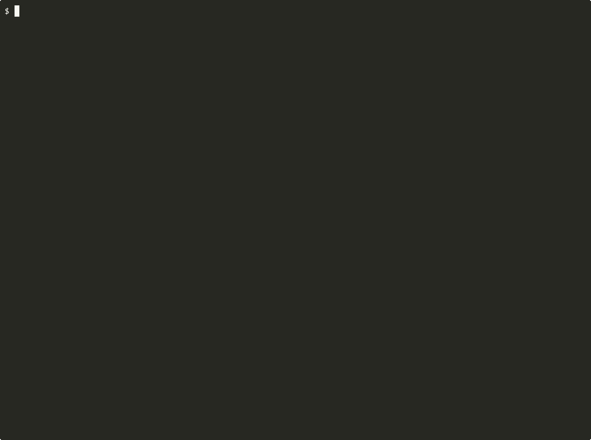

# NREKI - Bulletproof Shield for AI Coding Agents

<p align="center">
  
  
  
  
  
  
</p>

**MCP plugin that validates AI agent edits in RAM before they touch disk.** When Claude Code, Cursor, or Copilot changes a function signature in one file and breaks 30 others, NREKI catches it in milliseconds - the file is never written. If the error is structural (missing import, forgotten `await`), NREKI auto-fixes it in RAM. Zero tokens wasted on fix-retry doom loops.

**v12.0.0 — Edit-Safety MCP (BREAKING).** NREKI is an edit-safety layer: it validates and atomically commits agent edits, and provides local code navigation. Host agents bring their own semantic retrieval. **`hybrid_search` (NREKI + BM25 RRF fusion) was removed** — its +10pp recall did not justify the ~4.3× token cost for a use case that does not exist when the agent already has grep. `search` (Type Ledger semantic) and `fast_grep` (RAM-resident exact substring) cover local navigation; `nreki_code` batch-edits with in-RAM compiler/LSP validation. See [CHANGELOG.md](CHANGELOG.md#1200) for the migration path. (v11.0.0 amputated ONNX embeddings; v12.0.0 amputates BM25/hybrid — same precedent.)

<p align="center"></p>

## Install

```bash
# Claude Code
claude mcp add nreki -- npx -y @ruso-0/nreki

# Cursor / any MCP client - add to mcp.json:
{ "mcpServers": { "nreki": { "command": "npx", "args": ["-y", "@ruso-0/nreki"] } } }

# Optional: agent-aware instructions install (v11.3.0+)
npx @ruso-0/nreki init               # auto-detect agent (Claude Code / Cursor / Cline / Copilot / generic)
npx @ruso-0/nreki init --agent cursor # explicit; valid: claude, cursor, cline, copilot, generic
npx @ruso-0/nreki init --dry-run     # preview the plan, write nothing
npx @ruso-0/nreki init --force       # rewrite an existing NREKI block
```

What `nreki init` writes per agent:

| Agent     | Detected via                          | Files installed                                                       |
|-----------|----------------------------------------|-----------------------------------------------------------------------|
| `claude`  | `.claude/` or `CLAUDE.md`              | `CLAUDE.md`, `SKILL.md`, `.claude/hooks/nreki-enforcer.mjs`, `.claude/settings.json` |
| `cursor`  | `.cursor/` or `.cursorrules`           | `.cursor/rules/nreki.mdc` (with `alwaysApply: true` frontmatter)      |
| `cline`   | `.clinerules` (file or dir)            | `.clinerules/nreki.md`                                                |
| `copilot` | `.github/copilot-instructions.md`      | `.github/copilot-instructions.md` (appended)                          |
| `generic` | none of the above                      | `AGENTS.md`                                                           |

First MCP run indexes the project automatically in the background — `fast_grep` returns RAM-resident substring matches immediately while NREKI's semantic index warms (v11.2.1+). Zero config for TS/JS; point a `tsconfig.json` at your code and NREKI detects the right validation mode.

## How it works

```
AI proposes edit -> NREKI intercepts in RAM -> Compiler/LSP validates
  |                                              |
  |   No errors ----------------------> Two-Phase Atomic Commit to disk
  |   Errors found --> Auto-Heal (TS CodeFix + LSP codeAction, atomic)
  |                        |
  |        Fixed all? ---> Commit to disk
  |        Some remain? -> Full rollback. Disk untouched. Errors returned to agent.
```

Three tools (`nreki_navigate`, `nreki_code`, `nreki_guard`), 25 actions (10 navigate + 6 code + 9 guard), 4 languages (TS/JS, Go via gopls, Python via pyright). Works with any MCP-compatible agent. Apache 2.0.

## Highlights

- **Atomic multi-TextEdit healing.** When gopls or pyright proposes a quickfix with coupled edits (import + usage), NREKI applies every TextEdit of the chosen action together with per-file savepoints and bottom-up offset ordering. No more doom-loop retries where only the import lands and the usage stays broken.
- **Tolerant Patch mode.** `nreki_code action:"edit" mode:"patch"` now retries with indent-flexible matching when the exact-indent search fails and the content is unique. The literal-`$` guarantee is preserved end-to-end (no V8 `$&` / `$$` substitution surprises).
- **Cognitive Enforcer.** Agents can't `batch_edit` blindly - every edit in a batch is validated against a per-file passport (outline seen? symbol focused?). The v10.5.7 fix closed a bypass where 2+ edits could smuggle blind mutations through.
- **TTRD Bounties.** Successful strict-type restoration reports the exact CFI (Continuous Friction Index) discount to the agent. Pavlovian reinforcement that actually quantifies what improved.
- **Defect radar + ghost oracle.** Four inline detectors and a 0-ext-refs tagger run during `outline` - free signals, no extra tool call.
- **Executable engrams.** Pin insights to symbols. Engrams prefixed `ASSERT` survive AST mutation; everything else invalidates on body change so memory can't go stale.

## Language support (Validation + Auto-heal)

| Language | Validation | Auto-heal |
|----------|------------|-----------|
| TypeScript / JavaScript | Full (TS Compiler API) | TS CodeFix API |
| Go | gopls LSP sidecar | codeAction (atomic) |
| Python | pyright LSP sidecar | codeAction (atomic) |

## AST parser coverage

NREKI's tree-sitter parser layer indexes additional languages for
foveal compression + symbol retrieval + semantic-edit syntactic
validation. These languages do **not** have LSP sidecars and
therefore receive no auto-heal; otherwise their files participate
in the retrieval index identically to TypeScript files.

| Language    | Extensions                              | Parser | Foveal | Syntax check | LSP auto-heal | Type Ledger |
|-------------|-----------------------------------------|--------|--------|--------------|---------------|-------------|
| TypeScript  | .ts .tsx .mts .cts                      | ✓      | ✓      | ✓            | ✓ (tsc)       | ✓           |
| JavaScript  | .js .jsx .mjs .cjs                      | ✓      | ✓      | ✓            | ✓ (tsc)       | ✓           |
| Python      | .py                                     | ✓      | ✓      | ✓            | ✓ (pyright)   | —           |
| Go          | .go                                     | ✓      | ✓      | ✓            | ✓ (gopls)     | —           |
| CSS         | .css                                    | ✓      | ✓      | ✓            | —             | —           |
| JSON        | .json                                   | ✓      | ✓      | ✓            | —             | —           |
| HTML        | .html                                   | ✓      | ✓      | ✓            | —             | —           |
| **Kotlin**  | .kt .kts                                | ✓      | ✓      | ✓            | —             | —           |
| **Java**    | .java                                   | ✓      | ✓      | ✓            | —             | —           |
| **C++**     | .cpp .cc .cxx .hpp .hh .hxx .h*         | ✓      | ✓      | ✓            | —             | —           |
| **C**       | .c .h*                                  | ✓      | ✓      | ✓            | —             | —           |

Kotlin / Java / C++ / C activation in v11.0.x covers Android development
(Kotlin app layer + Java legacy + C++ NDK native layer + C NDK code) and the
broader JVM / native cross-platform ecosystem.

> *`.h` headers are routed at parse time: headers containing
> C++ markers (template, namespace, class, `#ifdef __cplusplus`)
> use the C++ grammar; pure C headers use the C grammar. Default
> to C grammar for ambiguous cases.

**Known limitation (v11.0.x):** cross-file import detection for
Kotlin / Java / C++ / C is not yet implemented. Repo-map dependency edges
for files in these languages are intra-file only until v11.0.x.1.

### Known limitations (v11.0.1)

**Android XML manifests and Gradle build files are NOT yet indexed.**
AndroidManifest.xml, resource XMLs (`res/layout/`, `res/values/`, etc.),
and Gradle build scripts (`build.gradle` Groovy DSL) coverage is tracked
for v11.0.2 (see issue #4).

**WASM checksum verification deferred.** Upstream grammar upgrades may not
propagate to vendor `wasm/` directory due to skip-if-exists logic in
`scripts/download-wasm.js`. SHA-256 checksum verification tracked as issue #5.

**chunks table lacks language column.** Retrieval language-aware scoring
requires runtime path extension filtering. Breaking migration tracked as
issue #6 (coordinated with v11.0.2 XML activation due to noise risk
amplification).

**Type Ledger (cross-file architectural dependency mapping) remains
TypeScript-specific by design** - it relies on TypeScript compiler-
derived type information. Multi-language Type Ledger expansion is
tracked under the Phase 8 roadmap.

## Docs & links

- **[CHANGELOG.md](CHANGELOG.md)** - full version history (every patch, every release, every test count).
- **[templates/CLAUDE.md](templates/CLAUDE.md)** - optimized instructions auto-installed by `npx @ruso-0/nreki init`.
- **Issues / ideas** - GitHub Issues on this repo.

## License

Apache 2.0. Zero cloud dependencies. Everything runs locally in the agent's process.
