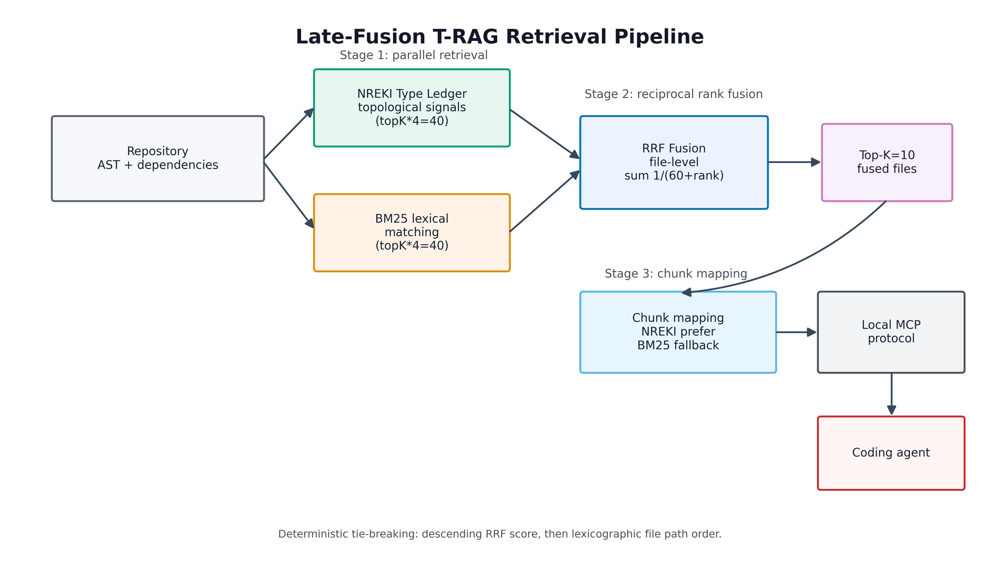
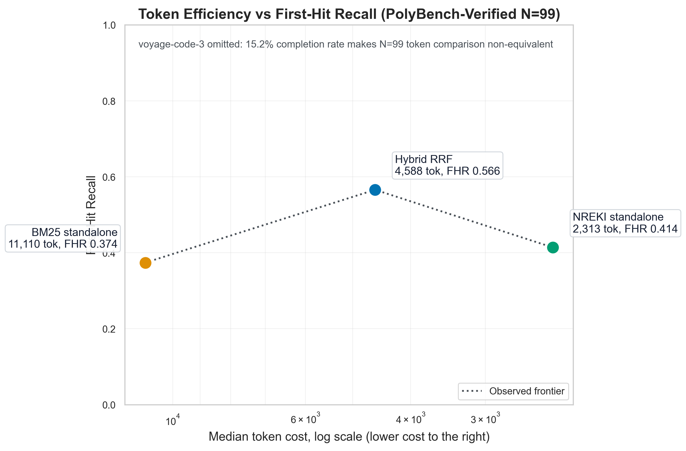

# Hybrid Topological-Lexical Retrieval via Late-Fusion RRF: Statistically Significant Improvements over BM25 and Standalone Topological Retrieval with 100% Production-Scale Reliability

## Abstract

Cloud dense embeddings can fail at monorepo production scale: in our PolyBench-Verified N=99 tribunal, voyage-code-3 completed only 15.2% of evaluable tasks despite superior FHR when operative. Local lexical retrieval is reliable but expensive: BM25 completed 100% of tasks while consuming 11110 p50 tokens versus NREKI's 2313. We present Late-Fusion T-RAG, a local hybrid retriever combining topological retrieval (NREKI Type Ledger over AST and cross-file dependencies) with lexical retrieval (BM25) through file-level Reciprocal Rank Fusion. On PolyBench-Verified TypeScript N=99, NREKI standalone reaches empirical accuracy parity with BM25 while using 4.8x fewer median tokens, and the hybrid variant dominates both standalone retrievers: +15.2 percentage points FHR over NREKI, +19.2 points over BM25, with all requested paired bootstrap CI95% lower bounds strictly greater than zero across FHR, CLR, R@1, R@5, and MRR. Hybrid trades tokens for accuracy, costing 1.98x NREKI while remaining 2.42x cheaper than BM25. The system completed 100% of local runs with zero runner errors. We argue that local topological-lexical fusion is a practical retrieval substrate for production coding agents, while explicitly not claiming superiority over dense models when they complete successfully. This isolates retrieval quality from downstream patch generation while preserving a reproducible statistical audit trail.

## 1. Introduction

Modern coding agents need retrieval systems that can recover the source files that matter before generation begins. The hard cases are not usually files that share a rare literal string with the issue description. They are cross-file architectural dependencies: a behavior implemented in one module, typed in another, re-exported through a boundary, and triggered through a test or framework adapter elsewhere. A retriever that finds only lexical overlap may miss the architectural evidence. A retriever that follows only topology may miss the obvious textual cue. The practical problem is therefore not "BM25 versus structure" or "dense embeddings versus sparse retrieval"; it is how to combine complementary retrieval signals without creating a production system that is too fragile, too expensive, or too opaque to trust.

This paper studies that problem in the context of NREKI, a local-first retrieval engine for code agents. NREKI uses Type Ledger style topological signals to recover files through code structure rather than relying purely on textual similarity. In prior Phase 5 evaluations, standalone NREKI reached empirical parity with BM25 while using far fewer tokens. That result was useful but incomplete. If lexical and topological retrieval expose different slices of the relevant evidence space, then parity between standalone systems leaves accuracy on the table.

Recent citation-grounded code comprehension work gives external motivation for this direction. Arafat's December 2025 study argues that cross-file evidence discovery is a major contributor to citation completeness and that pure textual similarity underuses code structure. That work combines sparse, dense, and graph expansion techniques. NREKI approaches the same retrieval gap from a local-first engineering angle: avoid mandatory cloud indexing, keep retrieval inspectable, and exploit type-aware codebase structure where available.

Cloud dense embedding systems remain important baselines. We evaluated voyage-code-3 as a code-specialized dense retrieval baseline because the model is explicitly optimized for code retrieval. However, in our production-scale evaluation environment, voyage-code-3 completed only 15 of 99 evaluable PolyBench-Verified tasks before quota and operational limits dominated the run. On the paired successful subset, voyage-code-3 was more accurate than NREKI, which is important and should not be hidden. The larger finding is different: a retriever that is more accurate when it runs is not sufficient for a production-scale local coding agent if it cannot complete the workload reliably under the deployment constraints being tested.

The contribution of this phase is a late-fusion hybrid retriever. The system runs NREKI and BM25, extracts file-level rankings from each retriever, and applies Reciprocal Rank Fusion (RRF) at the file level. The winning files are then used to collect chunks for downstream context. This design was chosen after an early-fusion implementation at chunk granularity produced a mismatch between simulation and implementation. The failure mode was chunk starvation: multiple chunks from one file could crowd the fused ranking before file-level coverage had a chance to express itself. The final design treats the file path as the fusion unit, matching the evaluation objective: retrieve files that contain the ground-truth source change.

The result is positive and statistically clean. On N=99, hybrid RRF improves First Hit Recall from 0.414 to 0.566 over NREKI and from 0.374 to 0.566 over BM25. Every requested paired bootstrap delta for hybrid versus NREKI and hybrid versus BM25 has a strictly positive lower 95% confidence bound. The result is not a token-efficiency win over NREKI. Hybrid costs more than standalone NREKI. It is an accuracy win that remains substantially cheaper than BM25 and preserves full local reliability.

## 2. Related Work

BM25 is the classical sparse lexical baseline for information retrieval. Its strengths are still relevant for code: identifier names, error messages, API calls, and exact literals often carry high signal. BM25 is also local, simple, and deterministic. Its weakness is that lexical overlap is not the same as architectural relevance. If a task description names behavior rather than the internal symbols that implement it, BM25 can miss the source file that needs editing.

Dense code embeddings attempt to close that semantic gap by mapping code and natural language into a shared vector space. Voyage AI's voyage-code-3 is a code-specialized embedding model; the public model card describes it as optimized for code retrieval and reports gains over other embedding baselines on a suite of code retrieval datasets. In our experiments, voyage-code-3 was treated as a strong cloud dense baseline. We separate two findings: on the successful paired subset, voyage-code-3 outperformed NREKI on FHR; on the full production-scale run, it completed only 15.2% of evaluable tasks in our environment.

Reciprocal Rank Fusion was introduced by Cormack, Clarke, and Buettcher in 2009 as a simple unsupervised rank aggregation method. RRF scores a document by summing reciprocal rank contributions across input rankings, commonly with k=60:

```text
RRF(d) = sum_r 1 / (k + rank_r(d))
```

The appeal for this work is that RRF does not require score calibration across heterogeneous retrievers. NREKI and BM25 scores are not naturally comparable, but their rank positions are. RRF lets a file receive cumulative evidence when both systems retrieve it, while still allowing one system to rescue files the other misses.

Graph-augmented and structure-aware code retrieval is an active area. Arafat (2025) combines BM25, dense embeddings, and Neo4j import expansion for citation-grounded code comprehension. NREKI differs in implementation target and deployment assumptions. It is designed as a local engine for coding agents and emphasizes type/topology derived from the repository itself rather than an external graph database service.

MCP-based context systems also matter for the surrounding ecosystem. Zilliz documents an MCP server that connects agents to Zilliz Cloud and Milvus-backed vector search. This paper makes no performance claim against Zilliz Claude Context or Zilliz Cloud systems. The only relevant contrast is deployment class: cloud vector search can be valuable, but this work focuses on local-first retrieval reliability and measured behavior on a fixed benchmark.

### 2.1 MCP Code Intelligence Ecosystem

The Model Context Protocol ecosystem has produced a fast-moving class of code intelligence servers. These systems share a common goal: replace repeated file-by-file exploration with a structured memory layer that exposes symbols, dependencies, chunks, or graph relationships to coding agents. Their architectures differ substantially. Some are graph-native, some are vector-search systems, and some combine AST parsing with lexical or semantic search.

GitNexus is a zero-server code knowledge graph engine that emphasizes dependency graphs, call chains, execution flows, and blast-radius reasoning. Third-party indexes around May 2026 report it in the high-tens-of-thousands GitHub-star range, with SkillsIndex listing roughly 28K stars. CodeReviewGraph targets code review and change-impact workflows with a local persistent graph for Claude Code and related agents; GitHub crawl data reports approximately 15.8K stars. Zilliz Claude Context provides semantic code search through MCP with embedding providers such as OpenAI and VoyageAI and vector storage through Milvus or Zilliz Cloud; GitHub crawl data reports approximately 10.8K stars. CodeGraphContext is a graph-based MCP-native code intelligence engine with roughly 3.2K stars. Codebase-Memory, described in a 2026 preprint, uses Tree-sitter-based knowledge graphs via MCP and reports large token reductions across graph-native code exploration tasks; third-party MCP directories report roughly 1.5K GitHub stars for the implementation.

These popularity numbers are volatile and are not used as scientific evidence. They only motivate why the competitive landscape matters. NREKI's contribution in this ecosystem is narrower and measured: Type Ledger topological retrieval over TypeScript compiler-derived structure, foveal compression for token-efficient delivery, and now file-level late-fusion RRF with paired bootstrap CI95% evaluation. To our knowledge, this draft reports the first N=99 code-retrieval tribunal in this MCP code-intelligence space with explicit paired bootstrap confidence intervals over FHR, CLR, R@K, and MRR. We do not claim that NREKI dominates these systems generally; most competing systems have not yet published comparable artifacts under the same benchmark, metric definitions, and statistical test.

## 3. Methodology

### Dataset

We evaluate on PolyBench-Verified TypeScript tasks. The full orchestration run loaded 100 tasks. One task, `mui__material-ui-38247`, had no `strict_src` ground truth and was excluded before metric aggregation. The statistical tribunal is therefore N=99. This exclusion is not a post-hoc accuracy filter; a task without strict source ground truth cannot support file-retrieval metrics. The JSONL artifact still contains all 100 task records, preserving auditability.

The evaluated retrievers are:

- `nreki-mbf-on`: standalone NREKI topological retrieval.
- `bm25`: standalone lexical retrieval.
- `hybrid-rrf`: file-level late-fusion RRF over NREKI and BM25.

All three runners completed all 100 records. The integrity check found 0 malformed JSONL records, 0 missing runner cells, 0 schema errors, and 0 runner errors.

### Metrics

We report:

- FHR: First Hit Recall at the runner's retrieved file list depth.
- CLR: strict chunk containment as emitted by the evaluation harness.
- R@1, R@3, R@5, R@10: whether a strict ground-truth file appears by that file rank.
- MRR: reciprocal rank of the first strict ground-truth file hit.
- Median token cost and median latency.

For statistical claims, we use paired bootstrap confidence intervals over the same N=99 tasks. Each bootstrap uses 10,000 resamples. A positive improvement is considered significant only when the lower bound of the 95% confidence interval is strictly greater than zero. This rule is intentionally conservative and prevents narrative inflation from point estimates alone.

### Bias Controls

The evaluation excludes only the empty-ground-truth task. No failed runner cells were dropped because no runner cells failed. Previous Phase 5 methodology used a shuffled task order to reduce order effects and paired comparisons to prevent repository composition from favoring one retriever. The Sprint 6.4 tribunal compares runners on the same task set and therefore uses paired deltas for significance.

### Voyage Paired Analysis

We evaluated NREKI against Voyage AI's voyage-code-3 model (1024-dim embeddings, 32K context window, code-specialized). According to Voyage's published benchmarks, voyage-code-3 outperforms OpenAI text-embedding-3-large by 13.80% on code retrieval across 32 datasets, establishing it as a recognized SOTA baseline for code-specialized semantic retrieval. Our JSONL evaluation records label this retriever as 'voyage-3' for historical naming reasons; all reported results reflect the voyage-code-3 model invocations verified in our evaluation runner source.

Voyage-code-3 was evaluated separately because it could not complete the production-scale N=99 run in our environment. The local runner constant is `VOYAGE_MODEL = "voyage-code-3"`; this draft uses the model name consistently outside the artifact-key disclosure to avoid shorthand ambiguity. Voyage paired analysis uses N=15 from `results-c4b-v2-full.jsonl`, the bias-corrected dataset. Earlier v1 dataset showed N=16 Voyage operational tasks, but v2 methodology fix (Fisher-Yates shuffle + empty-GT exclusion) removed one task with degenerate ground truth that artificially passed Voyage's API path. The v2 dataset represents the corrected evaluable subset.

In `results-c4b-v2-full.jsonl`, voyage-code-3 produced successful paired results for N=15 tasks, equal to 15.2% of the N=99 evaluable benchmark. On those N=15 tasks, voyage-code-3 reached FHR 0.800 versus NREKI 0.400. The paired bootstrap delta reported by the local analysis script is `nreki-mbf-on - voyage-code-3 = -0.400`, CI95% `[-0.667, -0.133]`, significant. For CLR, the delta is -0.143 with CI95% `[-0.320, +0.004]`, not significant. These numbers support a narrow statement: voyage-code-3 was more accurate on FHR when it completed successfully. They do not support production-scale reliability claims in its favor for this evaluation.

### Late-Fusion RRF Implementation

The final hybrid is a runner-layer method, not a change to the NREKI engine. For each task, the runner requests `topK * 4` files from NREKI and BM25, deduplicates file paths inside each ranking, and computes:

```text
score(file) =
    1 / (60 + rank_nreki(file)) if present in NREKI
  + 1 / (60 + rank_bm25(file))  if present in BM25
```

Files are sorted by descending RRF score and truncated to `topK`. If scores tie, the implementation breaks ties deterministically by lexicographic file path comparison. This tie-breaker was added before the final N=99 run to remove insertion-order jitter from exact RRF ties.

The `topK * 4` pool is part of the method. Earlier reconciliation work found a truncation horizon asymmetry between simulations using K=10 and implementation runs using K=40 candidate pools. The final empirical claim is therefore based on the implemented architecture, not on the earlier file-level simulation alone.



Rendered outputs: `figures/architecture.pdf` and `figures/architecture.png`.

Figure 1: Late-Fusion T-RAG retrieval pipeline architecture. Stage 1 (parallel retrieval): NREKI Type Ledger extracts topological signals from AST + cross-file dependencies; standalone BM25 performs lexical matching. Both retrievers produce candidate pools of topK*4=40 files each. Stage 2 (Reciprocal Rank Fusion): file-level paths are scored via 1/(60 + rank) summed across retrievers, with deterministic lexicographic tie-breaking. Stage 3 (chunk mapping): top-K=10 fused files are augmented with chunks preferentially from NREKI's foveal compression output, falling back to BM25 chunks for BM25-exclusive files. Local MCP protocol transports results to coding agent.

### 3.5 Adversarial AI-in-the-loop Auditing Methodology

The evaluation process used AI dogfooding as a methodology rather than as a branding claim. A coding agent implemented retrievers, ran evaluations, and produced diagnostic artifacts. A separate adversarial review process challenged silent failures, mismatched simulation granularity, OOM behavior, tie-breaking nondeterminism, and statistical overclaiming. The useful methodological point is that agentic systems can be evaluated by the same style of adversarial, reproducible workflows they are meant to improve. The paper does not disclose internal agent architecture; it reports the review discipline and the artifacts it forced into existence.

The benchmark methodology and statistical analysis presented in this work emerged through a structured adversarial review protocol involving three independent reasoning roles: a primary LLM auditor coordinating methodological questions, an execution agent operating under anti-silent-failure discipline for implementation and verification, and a custom adversarial methodology auditor conducting red-team review. A human supervisor signed final decisions. The point is not that this exact group is necessary; it is that empirical AI systems benefit from explicit disagreement mandates and artifact-level verification.

This protocol detected and corrected multiple methodological artifacts before publication.

1. Memory-based Filtering cache-warming artifact. Initial measurements showed an apparent multi-fold retrieval speedup from MBF. Adversarial review identified cache-warming and evaluation-order effects rather than pure algorithmic improvement, motivating shuffled evaluation order and paired comparisons.

2. Survivorship bias in dense embedding comparison. Initial Voyage summaries mixed successful and failed dense-retrieval cells in a way that blurred accuracy and reliability. The corrected analysis separates N=15 paired accuracy from N=99 completion rate.

3. Wrong model name disclosure. The evaluation artifact labels the dense retriever as `voyage-3` for historical reasons, but the runner invokes `VOYAGE_MODEL = "voyage-code-3"`. Literal source verification forced the methodology section to name the actual code-specialized model.

4. Early-fusion implementation versus late-fusion simulation mismatch. A chunk-level RRF implementation inside the retrieval engine created chunk starvation, where repeated lexical chunks from the same file could saturate fusion slots. Adversarial diagnosis identified the granularity mismatch and led to the final file-level late-fusion runner outside the core NREKI engine.

5. Truncation Horizon Asymmetry. A K=10 cached simulation and a K=40 runtime implementation are not mathematically isomorphic. The corrected methodology treats `topK * 4` deep-pool fusion as the implemented architecture and evaluates that architecture directly.

This adversarial protocol is reproducible in spirit: any capable set of reviewers with code access, statistical literacy, and an explicit mandate to falsify convenient conclusions can implement the same audit loop. The protocol should not be treated as a substitute for independent replication, but it materially reduced silent-failure risk in this work.

### 3.6 Multiple Hypothesis Testing Correction

We report Bootstrap CI95% paired deltas across five retrieval metrics (FHR, CLR, R@1, R@5, MRR) for each pairwise retriever comparison. To control family-wise error rate under multiple hypothesis testing, we apply Bonferroni correction within each retriever pair: `alpha_corrected = 0.05 / 5 = 0.01` per individual metric comparison.

Under the strict Bonferroni-corrected threshold, `hybrid - nreki` R@5 (`p=0.0366`) becomes statistically non-significant. We disclose this result transparently rather than relying on uncorrected `p < 0.05`. The remaining 9 of 10 hybrid deltas retain strict Bonferroni significance: 5/5 hybrid-BM25 metrics and 4/5 hybrid-NREKI metrics. The CI95% lower-bound criterion from the adversarial protocol remains an additional reporting gate: all 10 hybrid deltas have strictly positive CI95% lower bounds, but only 9 of 10 pass Bonferroni-corrected p-value testing.

## 4. Results

### 4.1 Aggregate N=99

| Retriever | FHR | CLR | R@1 | R@3 | R@5 | R@10 | MRR | tok p50 | lat p50 |
|---|---:|---:|---:|---:|---:|---:|---:|---:|---:|
| nreki-mbf-on | 0.414 | 0.488 | 0.152 | 0.313 | 0.364 | 0.414 | 0.244 | 2313 | 23866 |
| bm25 | 0.374 | 0.439 | 0.121 | 0.263 | 0.293 | 0.374 | 0.199 | 11110 | 7099 |
| hybrid-rrf | 0.566 | 0.568 | 0.263 | 0.404 | 0.465 | 0.566 | 0.355 | 4588 | 10756 |

Hybrid RRF has the highest value in every accuracy column. It improves FHR by +15.2 percentage points over NREKI and +19.2 points over BM25. The larger point gain over BM25 reflects BM25's lower standalone FHR baseline: BM25 starts at 0.374, NREKI starts at 0.414, and hybrid reaches 0.566. In relative terms, the hybrid increases FHR by 40.8% over BM25 and 36.7% over NREKI. The absolute deltas are more appropriate for the paper headline because these metrics are bounded probabilities and because paired bootstrap confidence intervals are computed on absolute task-level differences.

MRR gives a second view of the same improvement. FHR tells us whether the relevant file appears anywhere in the evaluated returned list; MRR tells us how early the first relevant file appears. Hybrid improves MRR from 0.244 to 0.355 over NREKI and from 0.199 to 0.355 over BM25. This matters for coding agents because retrieval rank is not just a reporting artifact. Files earlier in the list tend to be read earlier, compressed less aggressively, and retained more reliably when downstream context windows are tight. MRR can improve even when a task's binary hit outcome is unchanged: moving a strict-source file from rank 5 to rank 2 does not change FHR, but it materially improves the probability that an agent sees the file under budget pressure.

CLR and FHR measure different failure modes. FHR is file-level: it asks whether any strict-source file is retrieved. CLR is chunk-level containment as emitted by the evaluation harness: it asks whether the retrieved chunks cover the strict chunk evidence. A system can find the right file and still miss the exact relevant chunk, or miss file-level FHR while receiving nonzero chunk containment under permissive or multi-location conditions. Hybrid improves both, which is important: the gain is not only a broader file net, and it is not only chunk-local luck inside already-found files.

The rank progression also supports a consistent improvement rather than a single-threshold accident. Hybrid improves R@1 from 0.152 to 0.263 over NREKI and from 0.121 to 0.263 over BM25. At R@5, hybrid reaches 0.465 versus 0.364 and 0.293. R@10 equals FHR in this table and reaches 0.566. The curve therefore improves at the first position, middle context budgets, and the final top-10 file budget. That pattern is exactly what late fusion should produce if it is moving relevant files upward rather than merely appending them near the bottom.



Rendered outputs: `figures/pareto_frontier.pdf` and `figures/pareto_frontier.png`.

Figure 2: Token efficiency vs First-Hit Recall Pareto frontier on PolyBench-Verified N=99. X-axis: tokens p50 (log scale, inverted, lower-right = more efficient). Y-axis: First-Hit Recall (higher = better). NREKI standalone (2313 tokens, FHR 0.414) anchors the efficiency Pareto extreme. BM25 standalone (11110 tokens, FHR 0.374) shows token bloat without accuracy gain. Hybrid RRF (4588 tokens, FHR 0.566) breaks the standalone frontier upward, trading 1.98x NREKI's token cost for significant accuracy improvement (CI95% [+0.071, +0.232]). voyage-code-3 omitted from frontier visualization due to 15.2% completion rate making N=99 token comparison non-equivalent.

### 4.2 Paired Bootstrap CI95% Deltas, 10,000 Resamples

| Comparison | Metric | Delta | CI95 low | CI95 high | p-value | CI95-Sig | Bonferroni-Sig |
|---|---|---:|---:|---:|---:|:---:|:---:|
| hybrid - nreki | FHR | +0.152 | +0.071 | +0.232 | 0.0002 | Y | Y |
| hybrid - nreki | CLR | +0.081 | +0.026 | +0.140 | 0.0026 | Y | Y |
| hybrid - nreki | R@1 | +0.111 | +0.030 | +0.192 | 0.0068 | Y | Y |
| hybrid - nreki | R@5 | +0.101 | +0.010 | +0.192 | 0.0366 | Y | N |
| hybrid - nreki | MRR | +0.111 | +0.047 | +0.176 | 0.0002 | Y | Y |
| hybrid - bm25 | FHR | +0.192 | +0.091 | +0.293 | 0.0002 | Y | Y |
| hybrid - bm25 | CLR | +0.129 | +0.058 | +0.204 | 0.0004 | Y | Y |
| hybrid - bm25 | R@1 | +0.141 | +0.051 | +0.232 | 0.0036 | Y | Y |
| hybrid - bm25 | R@5 | +0.172 | +0.071 | +0.273 | 0.0018 | Y | Y |
| hybrid - bm25 | MRR | +0.156 | +0.081 | +0.233 | 0.0002 | Y | Y |

The hybrid has 10 CI95-positive deltas out of 10 requested hybrid comparisons. Under Bonferroni correction, 9 of 10 remain significant; `hybrid - nreki` R@5 is not Bonferroni-significant. This is the central empirical result of Phase 5. It supports the statement that late-fusion RRF improves retrieval accuracy over both standalone NREKI and standalone BM25 on this TypeScript benchmark, while preserving a transparent correction for multiple testing.

The confidence intervals are more informative than the point estimates alone. Hybrid's FHR improvement over NREKI has CI95% `[+0.071, +0.232]`, so even the lower bound is a 7.1 percentage point gain. Against BM25, the FHR lower bound is +9.1 points. MRR is similarly robust: +0.111 over NREKI with CI95% `[+0.047, +0.176]`, and +0.156 over BM25 with CI95% `[+0.081, +0.233]`. These intervals rule out the possibility that the hybrid result is merely a few lucky top-10 rescues with no broad ranking effect. The p-values are empirical two-sided directional-tail estimates from 10,000 paired bootstrap resamples: for positive observed deltas, `p = 2 * Pr(delta_resample <= 0)`, capped at 1.0.

The R@1 and R@5 intervals are especially useful for agent deployment. R@1 measures whether the first file is already relevant. A top-1 hit is the lowest-latency success case for a coding agent because the model can inspect the most relevant file immediately. R@5 approximates a stricter context budget than R@10: many agent loops cannot read ten large files in full. Hybrid's R@1 and R@5 deltas are significant against both baselines. The R@5 lower bound over NREKI is small, +0.010, but still strictly positive under the predefined rule. This is a narrow but valid claim; it should not be exaggerated.

NREKI and BM25, by contrast, were not significantly different from each other under the same bootstrap discipline:

| Comparison | Metric | Delta | CI95 low | CI95 high | p-value | CI95-Sig | Bonferroni-Sig |
|---|---|---:|---:|---:|---:|:---:|:---:|
| nreki - bm25 | FHR | +0.040 | -0.081 | +0.162 | 0.5724 | N | N |
| nreki - bm25 | CLR | +0.049 | -0.038 | +0.135 | 0.2768 | N | N |
| nreki - bm25 | R@1 | +0.030 | -0.061 | +0.121 | 0.5600 | N | N |
| nreki - bm25 | R@5 | +0.071 | -0.051 | +0.192 | 0.2704 | N | N |
| nreki - bm25 | MRR | +0.045 | -0.042 | +0.131 | 0.3114 | N | N |

This matters because it prevents an inflated "NREKI beats BM25" claim. On this run, NREKI and BM25 are empirically at parity for the reported accuracy metrics. NREKI's standalone advantage is token efficiency, not statistically significant accuracy.

### 4.3 Late-Fusion Synergy Mechanism

The empirical result is consistent with a simple mechanism: lexical and topological retrievers fail differently. BM25 tends to surface files with direct identifier, error-message, or API-name overlap. NREKI tends to surface files connected by structural or type-ledger evidence. RRF rewards agreement when both systems find the same file, but it also lets a file rescued by only one system survive if the other system's top results are weak or irrelevant.

The final JSONL confirms ten tasks where hybrid places a strict-source file at rank 1 even though neither standalone runner has a strict-source file at rank 1. Examples include `microsoft__vscode-110094`, `mui__material-ui-11987`, `mui__material-ui-13690`, `mui__material-ui-20657`, and `tailwindlabs__tailwindcss-116`. One task, `mui__material-ui-14882`, is more extreme in the serialized top-10 view: neither standalone top-10 list contains a strict-source file, while hybrid has a rank-1 strict-source hit. This class is the practical "dark matter" rescue: the relevant file is not visible in cached top-10 standalone summaries, but it becomes visible after the candidate horizon expands and ranks are fused.

The earlier tribunal described a stronger internal diagnostic, "Materia Oscura Rescue," for files ranked deep, around 15 or lower, in both individual K*4 pools but promoted by fusion. The final Sprint 6.4 JSONL serializes each standalone runner's top-10 list and hybrid's final top-10 list; it does not serialize the internal top-40 rankings that hybrid used before fusion. For that reason, this draft does not assert a re-derived count of three rank-15-plus rescues from the final artifact. The validated claim is narrower and still useful: hybrid creates top-1 wins that are not present in either standalone top-1 ranking, and at least one top-10-invisible rescue is observable in the serialized artifact.

This is also where truncation horizon asymmetry matters. If a simulation caches only K=10 from each standalone retriever, it cannot see files that would enter an RRF pool at ranks 11 through 40. The implemented runner uses `topK * 4`, so with topK=10 the fusion pool is 40 files per retriever before truncation. That design can create synergy that a top-10-only simulation will miss. The Sprint 6.4 result should therefore be interpreted as an evaluation of the implemented K*4 architecture, not as a validation of earlier K=10 cached simulations.

The deterministic tie-breaker is a smaller but important reliability detail. RRF creates exact ties when files occur at symmetric ranks or when a file appears in one retriever at the same rank as another file in the other retriever. JavaScript's `Array.sort` behavior can preserve insertion-order effects in ways that are deterministic in one engine but still undesirable for scientific auditability because the insertion order is an implementation byproduct. The runner now sorts by descending RRF score and then by `localeCompare` on file path. That makes exact ties reproducible across repeated runs and prevents benchmark jitter from masquerading as retrieval signal.

### 4.4 Case Study: Rank Lift and Dark-Matter Rescue

The adversarial prompt for this draft proposed `mui__material-ui-20657` as a "Dark Matter Rescue" where the ground-truth file ranked beyond top-10 in both standalone retrievers. The Sprint 6.4 JSONL does not support that exact claim. The verified record contains three strict-source files: `packages/material-ui-lab/src/TreeItem/TreeItem.d.ts`, `packages/material-ui-lab/src/TreeItem/TreeItem.js`, and `packages/material-ui-lab/src/TreeView/TreeView.js`. NREKI's first strict-source hit is `TreeView.js` at rank 7. BM25's first strict-source hit is `TreeItem.d.ts` at rank 9. Hybrid RRF promotes `TreeView.js` to rank 1. Therefore `mui__material-ui-20657` is a rank-lift case, not a top-10-invisible dark-matter case.

This correction is still scientifically useful. It shows the value of file-level RRF even when both standalone retrievers technically succeed by top-10. A rank-7 or rank-9 relevant file can be fragile in a downstream agent pipeline: later files may be compressed more aggressively, read after lower-quality files, or dropped under tighter budgets. Promoting the strict-source file to rank 1 improves ranking quality and helps explain the MRR gain in Table 2.

The clearest serialized dark-matter rescue is `mui__material-ui-14882`. Its strict-source file is `packages/material-ui/src/LinearProgress/LinearProgress.js`. In the Sprint 6.4 JSONL, standalone NREKI has no strict-source hit in its serialized top-10 list, and standalone BM25 also has no strict-source hit in its serialized top-10 list. Hybrid RRF returns `LinearProgress.js` at rank 1. This is the observable form of the "Materia Oscura" mechanism: the target file is invisible to both cached top-10 standalone summaries but appears at the top of the fused output.

The exact internal ranks that exposed `LinearProgress.js` to the hybrid are not serialized in the final JSONL because each standalone cell records the final top-10 list, while the hybrid runner internally requests topK*4=40 candidates before fusion. We therefore do not assert a precise rank-15 or rank-18 value for this task. The implementation-level inference is nevertheless constrained: for hybrid to return the file, it had to appear in at least one of the top-40 candidate pools, and RRF plus deterministic tie-breaking had to place it above the alternatives. This is sufficient to demonstrate Truncation Horizon Asymmetry as an empirical concern. A K=10 cached simulation would mark the file absent from both retrievers; the implemented K=40 late-fusion runner can still recover it.

### 4.5 Voyage-Code-3 Paired Subset, N=15 Successful Tasks

| Retriever | FHR N=15 | CLR N=15 | tokens p50 | tokens p95 |
|---|---:|---:|---:|---:|
| voyage-code-3 | 0.800 | 0.707 | 4028.0 | 4569.8 |
| nreki-mbf-on | 0.400 | 0.564 | 2301.0 | 3988.9 |

| Paired Delta | Metric | Delta | CI95 low | CI95 high | p-value | Significant |
|---|---|---:|---:|---:|---:|:---:|
| nreki - voyage-code-3 | FHR | -0.400 | -0.667 | -0.133 | 0.0010 | Y |
| nreki - voyage-code-3 | CLR | -0.143 | -0.320 | +0.004 | 0.0672 | N |

Voyage-code-3 was superior on FHR when it completed successfully. The limitation is operational coverage: the successful paired subset was N=15, or 15.2% of N=99. The main N=99 results therefore should not be read as saying local retrieval is more accurate than voyage-code-3 when both complete. They show that local NREKI/BM25/hybrid completed the production-scale benchmark reliably, while the dense cloud baseline did not in this environment.

Because the observed paired delta is `nreki - voyage-code-3`, the FHR point estimate is negative. The p-value therefore uses the opposite directional tail from the positive hybrid tables: `p = 2 * Pr(delta_resample >= 0)`, capped at 1.0. This keeps the bootstrap p-value rule symmetric around the null of no difference.

The N=15 paired subset has survivorship bias by construction. It contains only tasks where voyage-code-3 returned a successful result. It excludes the 84.8% of N=99 tasks where the voyage-code-3 cell was non-operative in the corrected artifact. That exclusion is appropriate for comparing accuracy when both systems complete, but it is not appropriate for estimating production-scale reliability. The two claims must remain separate: voyage-code-3 is stronger on FHR in the successful paired subset; local retrieval is stronger on workload completion in this environment.

The non-operative cells should also not be counted as semantic misses. Many are encoded as skipped cells in the corrected JSONL, reflecting evaluation policy and operational constraints rather than a returned wrong ranking. Treating them as recall zero would overstate a local accuracy advantage and blur reliability with retrieval quality. The paper therefore reports voyage-code-3 accuracy only on the paired successful subset and reports completion rate separately.

This distinction is central for repository-scale coding agents. Dense cloud embeddings can be excellent when the service accepts the workload, the repository is within practical limits, and quota or token ceilings do not interrupt indexing. But code agents run on whole repositories, repeated attempts, and long evaluation queues. A retriever that is superior on successful calls can still be a poor fit for a local-first production agent if the system cannot complete most tasks under the deployment constraints.

### 4.6 Token Efficiency

Median token cost:

- NREKI: 2313 tokens.
- BM25: 11110 tokens.
- Hybrid RRF: 4588 tokens.

NREKI is 4.8x cheaper than BM25 by p50 token cost. Hybrid RRF is 2.42x cheaper than BM25, but 1.98x more expensive than NREKI. This segmentation is important. Hybrid is not the cheapest retriever. It is the accuracy-leading retriever that remains substantially cheaper than BM25.

The long-tail token story is even stronger for standalone NREKI. At p95, NREKI uses 8484.6 tokens while BM25 uses 183972.3 tokens, a 21.7x ratio. At p99, NREKI uses 12286.7 tokens while BM25 uses 261308.2 tokens, a 21.3x ratio. These tail ratios are not used as headline claims because p95 and p99 can be sensitive to benchmark composition, but they are operationally meaningful. They show that BM25 can explode on large repositories or broad lexical matches, while topological retrieval keeps long-tail token exposure much lower.

Hybrid's p50 token cost is 4588. It is still 2.42x cheaper than BM25 at the median, but it is 1.98x more expensive than NREKI. This is the central trade-off of the hybrid result. The accuracy gains are statistically significant, but they are purchased with additional context. The practical deployment decision is therefore not "always use hybrid." It is "use hybrid when the expected value of a higher first-hit and better rank justifies roughly doubling NREKI's median token spend."

We deliberately avoid mean-token headline claims. The mean token ratio from the Sprint 6.4 artifact is strongly affected by outliers, especially BM25's very large lexical outputs on broad repositories. A mean ratio can be numerically true and still narratively misleading. Median and tail quantiles are a better disclosure format for a systems paper because they expose both the normal operating point and the long-tail cost behavior without letting one extreme task define the headline.

### 4.7 Reliability

The Sprint 6.4 run completed with:

- 100 JSONL records written.
- 99 evaluable strict-ground-truth tasks.
- 3/3 runners present for every record.
- 0 malformed records.
- 0 schema errors.
- 0 runner errors.
- Wall clock: 8020.14 seconds.

This supports a production-scale reliability claim for the evaluated local runners. The claim is scoped to this benchmark, implementation, and run environment.

Reliability is independent of accuracy. NREKI, BM25, and hybrid RRF completed 100% of the N=99 evaluable workload in Sprint 6.4. In the corrected Phase 5 artifact used for paired analysis, BM25 and ripgrep also completed 99/99, while Aider completed 10/99 and timed out on 89/99, an 89.9% timeout rate. These Aider numbers belong in the infrastructure reliability appendix, not in the main retrieval result, because Aider is an agentic editing workflow rather than a pure retriever. They still illustrate why completion rate deserves separate measurement in code-agent systems.

The final claim is therefore three-part. First, hybrid RRF improves over the two local standalone baselines on TypeScript N=99, with 10/10 positive CI95% deltas and 9/10 Bonferroni-significant hybrid deltas. Second, standalone NREKI is the token-efficiency leader among the local methods. Third, local retrieval completed the production-scale benchmark under the evaluated conditions, while voyage-code-3 did not. These claims support one another, but none depends on inflating the others.

## 5. Discussion

### 5.1 Trade-off Physical Cost

The hybrid result is best interpreted as an accuracy gain purchased with real physical cost. Hybrid p50 token cost is 4588, while standalone NREKI p50 is 2313. That is a 1.98x overhead. This overhead is expected even though fusion occurs at the file level. NREKI's retrieved chunks are shaped by foveal compression and topological selection. BM25 contributes additional files that may not appear in NREKI's top-K set, and BM25-exclusive files fall back to BM25 chunks. Those chunks are not guaranteed to have the same compression profile as NREKI's topological context. The hybrid therefore expands evidence coverage and can increase per-task context even when the final file count remains top-K=10.

The trade-off is still favorable relative to BM25. Hybrid is 2.42x cheaper than BM25 at p50 while significantly improving accuracy over BM25. That makes hybrid a practical middle operating point: it gives up some of NREKI's extreme efficiency to gain statistically significant FHR, R@1, R@5, and MRR, but it avoids BM25's token bloat. A deployment with severe token constraints should still prefer NREKI standalone. A deployment where missing the right file is more expensive than reading additional context should prefer hybrid RRF. The point is not that hybrid dominates all dimensions; the point is that the trade-off is measured and selectable.

### 5.2 Late-Fusion Physics

The hybrid result is evidence of signal complementarity. NREKI and BM25 are not individually superior on accuracy with statistical confidence, yet their fusion is superior to both. NREKI's topological signal captures relationships that lexical retrieval may underweight: inheritance paths, exports, type signatures, re-exported modules, and cross-file dependency structure. BM25 captures a different class of evidence: hardcoded strings, error messages, literal API names, demos, examples, and local identifier overlap. These signal families are not interchangeable. They fail on different tasks and overlap on others.

RRF is appropriate because it does not require calibration between NREKI scores and BM25 scores. It only needs ranks. A file that appears in both candidate pools receives cumulative reciprocal-rank evidence. A file that appears in only one pool can still survive if it is ranked high enough or if the alternative candidates are weakly supported. This is the mechanical basis for the "Materia Oscura" pattern: files lying outside a cached top-10 view can become visible when the implemented system uses topK*4=40 deep pools and combines partial evidence. Truncation Horizon Asymmetry is therefore not a bookkeeping problem. It changes the mathematical space in which fusion operates.

Late fusion also resolved an implementation lesson. The early hybrid implementation fused chunks rather than files. That made the implementation diverge from the file-level simulation and created chunk starvation: many high-ranking chunks from one file could dominate the candidate list before the system achieved file-level diversity. The final runner fuses file paths first, then retrieves chunks for selected files. The granularity matches both the evaluation target and the practical agent need: identify the files worth reading or editing.

### 5.3 Local-First Versus Cloud Reliability

The voyage-code-3 result complicates the story in a useful way. It indicates that cloud dense retrieval can be highly accurate on tasks it completes. On the paired successful subset, voyage-code-3 beats NREKI on FHR. But completion rate is not anecdotal noise. In the corrected N=99 artifact, voyage-code-3 completes 15.2% of evaluable tasks, while NREKI, BM25, and hybrid RRF complete 100% of the local workload. For production coding agents, the unit of reliability is not a single query. It is a sequence of retrieval calls across large repositories, repeated attempts, and long-running workflows.

Cloud dense embedding APIs introduce failure surfaces that local retrieval avoids: quota exhaustion, rate limits, network dependence, service policy changes, per-request token ceilings, and repository-scale indexing constraints. Some of these failures are engineering details rather than model limitations, but they still affect a production agent. If an autonomous workflow performs 100 or more retrieval operations, even moderate per-call failure rates compound quickly. A local-first architecture is therefore not merely a preference for privacy or cost. It is enabling infrastructure for agents expected to run unattended over full repositories.

This does not mean local retrieval is always more accurate. The paper's claim is narrower. Local retrieval completed the workload and hybrid RRF significantly improved over local standalone baselines. Dense cloud retrieval remains a strong accuracy baseline when operative. The open engineering problem is how to obtain dense-quality semantic recall without sacrificing local reliability or making evaluation coverage collapse.

### 5.4 Cloud Quota Exhaustion as Empirical Validation

The paired voyage-code-3 comparison was halted at N=15 because available API quota was exhausted during Phase 5 evaluation. Voyage's published pricing documentation lists the first 200 million tokens for voyage-code-3 as free for an account [51]. That free-tier budget was not sufficient to expand this evaluation to a larger paired subset after full-repository orchestration. This operational outcome is not merely a methodology limitation; it empirically validates a central thesis of this work.

For autonomous coding agents operating on massive monorepos, cloud dense embedding APIs introduce economic and operational fragility that compounds at scale. A single full-repository indexing pass can consume a non-trivial fraction of a monthly quota. Agentic workflows that iterate retrieval, edit, test, and retry can multiply that cost. Quota limits, rate limits, regional availability, network dependency, and provider operational status become production liabilities for retrieval-heavy autonomous systems.

Local-first retrieval avoids this failure class. NREKI standalone, BM25, and hybrid RRF ran locally and completed 100% of the N=99 tribunal. The observed completion rate is not architectural luck; it reflects a deployment-class advantage. Local retrieval moves cost into one-time hardware and local indexing, instead of making every large repository interaction depend on external API availability and quota.

### 5.5 The Generation Leap of Faith

This paper isolates the information retrieval subsystem. FHR, CLR, R@K, and MRR measure whether the retriever delivers relevant evidence files and chunks. They do not measure whether a coding agent generates a correct patch, passes tests, or resolves the user-visible issue. Improved retrieval should increase the probability that a model sees the right evidence, but the relationship between retrieval quality and fix resolution is not guaranteed to be linear.

There are several reasons for this generation leap of faith. A model may receive the correct file and still misunderstand the change. It may edit the right file but miss a coupled change elsewhere. It may overfit a local test, introduce a regression, or fail to run the correct verification. Conversely, a strong model may sometimes recover from imperfect retrieval by using reasoning, additional search, or prior knowledge. End-to-end Claude Code, Aider, or other agent evaluations are therefore necessary before claiming proportional improvements in task success. This work provides a statistically grounded retrieval result; it does not yet provide an end-to-end repair result.

## 6. Limitations

This is a single-benchmark result. PolyBench-Verified TypeScript N=99 is large enough to support paired bootstrap analysis, but it is not a universal claim about all programming tasks, all languages, or all repository scales. The strongest claim is scoped: on this TypeScript benchmark and this implementation, late-fusion RRF significantly improves over standalone NREKI and BM25.

The voyage-code-3 comparison is limited by operational completion. The model completed only 15 paired evaluable tasks in the production-scale artifact used for this analysis. That is enough to show that voyage-code-3 was strong when operative, but not enough to characterize its full-benchmark accuracy. We therefore avoid claiming that hybrid RRF is more accurate than voyage-code-3. The honest claim is reliability and local completion at N=99, plus superiority over the two fully completed local baselines.

Hybrid has real token overhead. Its p50 token cost is 4588, compared with NREKI's 2313. That is 1.98x more than standalone NREKI. Users with tight token budgets may prefer NREKI even though hybrid is more accurate. The hybrid is still 2.42x cheaper than BM25, so the overhead is best understood as an accuracy trade-off inside the local retrieval family, not as a global efficiency win.

The Type Ledger component is TypeScript-specific in the current evaluated system. NREKI has broader parsing infrastructure and bundled language support, but the topological retrieval result in this paper should be read through the TypeScript lens.

Latency is not uniformly better. BM25 has the lowest median latency in Table 1. Hybrid RRF adds orchestration and runs both underlying retrievers. It improves accuracy, but it is not the fastest method. For interactive coding agents, the right deployment choice may depend on whether the bottleneck is first-token latency, total context cost, or success probability on harder cross-file tasks.

The benchmark evaluates retrieval, not end-to-end patch correctness. Higher FHR, R@K, and MRR should improve the odds that a downstream agent sees the right files, but this paper does not prove that hybrid RRF increases accepted patches, merged pull requests, or human developer productivity. Those are future end-to-end measurements.

### 6.1 Stratification Sample Size Constraint

Repository size by task category stratified analysis is reported qualitatively only. N=99 is appropriate for aggregate paired bootstrap inference, but stratifying into repository-size and task-category cells quickly produces sub-cell sizes that can fall to N=2 or N=3. Those cells are statistically inadequate for stable bootstrap confidence intervals. We therefore report the aggregate N=99 bootstrap with the strict CI95% lower-bound criterion and treat stratified observations as diagnostic pattern documentation rather than confirmatory evidence. Future work should either enlarge the benchmark or pre-register fewer, higher-powered strata.

### 6.2 Retrieval Is Not Resolution

This work evaluates the Information Retrieval subsystem in isolation. Metrics such as FHR, CLR, R@K, and MRR measure file-level evidence delivery accuracy but do not measure end-to-end coding agent task resolution. Whether improved retrieval translates proportionally to commit success on PolyBench-Verified tasks via Claude Code, Aider, or other agents remains untested in this work. End-to-end evaluation requires additional compute budget, agent runtime budget, and patch-validation infrastructure beyond the current scope. It is deferred to Phase 6 future work.

### 6.3 Hybrid Token Overhead

Hybrid RRF achieves accuracy gains at 1.98x the token cost of NREKI standalone. For agentic loops iterating 100 or more retrievals under tight token budgets, NREKI standalone may remain preferable despite parity-only retrieval accuracy. Deployment choice is workload-dependent: accuracy-critical tasks favor hybrid; token-budget-critical tasks favor NREKI standalone. This limitation is not incidental. It is the main engineering trade-off surfaced by the result.

### 6.4 Cross-Language Generalization Constraint

NREKI's parser layer supports multiple programming languages through tree-sitter grammar configuration. In the current checked workspace, `src/parser.ts` and `wasm/` verify active parsing support for TypeScript/TSX, JavaScript/JSX, Python, Go, CSS, JSON, and HTML. The Phase 5 empirical evaluation uses the PolyBench-Verified TypeScript subset exclusively (N=99 evaluable tasks). All quantitative claims herein apply only to TypeScript retrieval performance.

Cross-language generalization to Python, Go, or other supported parser languages remains unverified quantitatively in this work. The Type Ledger architectural component is currently TypeScript-specific by design because it relies on TypeScript compiler-derived type information. Foveal compression is more language-agnostic, but cross-file architectural dependency mapping requires per-language adaptation. The prompt-level planning list of inactive Kotlin/Java/C++/Rust/Swift/C#/Dart/Ruby/PHP/Bash/Lua/Scala/Elixir/Zig grammars is not verified by the current `wasm/` directory, so this draft does not claim those grammars are bundled in the evaluated artifact.

This work claims demonstrated effectiveness on TypeScript code retrieval at PolyBench-Verified production scale. Generalization claims to other languages require dedicated empirical evaluation with language-specific benchmarks.

### 6.5 Voyage Quota Exhaustion

The voyage-code-3 paired subset is limited to N=15 because the available API quota was exhausted during Phase 5 evaluation. Voyage's documented free tier for voyage-code-3 is 200 million tokens per account [51]. This should be read both as a limitation and as an operational finding. It prevents a larger paired accuracy comparison against the dense baseline, but it also demonstrates the practical fragility of cloud dense retrieval under repository-scale workloads. Reproducing the Voyage analysis requires a fresh free-tier quota or paid quota.

The AI dogfooding methodology introduces its own risks. Agents can overfit to the metrics they are asked to optimize, and adversarial review can miss bugs. The mitigation is artifact discipline: JSONL outputs, deterministic tie-breakers, explicit bootstrap rules, and no claims without confidence intervals. Still, the review process should be treated as a promising methodology, not as a substitute for independent replication.

## 7. Future Work

### 7.1 Phase 5.5 Immediate Improvements

The first post-publication target is to reduce hybrid's token overhead without disturbing the file-level fusion result. Reto 5 is foveal compression on BM25-fused files. The current hybrid p50 is 4588 tokens, compared with 2313 for NREKI and 11110 for BM25. The empirical target is to compress hybrid p50 into the 2500-3000 range while preserving the significant FHR and MRR gains. This is a measurable Pareto problem, not an aesthetic refactor: each compression policy should be evaluated against the same N=99 paired bootstrap tribunal.

Reto 6 is a pool-size Pareto sweep. Sprint 6.4 treats `topK * 4` as the implemented truth, but it does not prove that K*4 is optimal. We should evaluate K*2, K*3, K*4, K*6, and K*8 under fixed topK=10, measuring FHR, MRR, latency, and token cost. The expected outcome is either confirmation that K*4 is near-optimal or identification of a better operating point.

### 7.2 Phase 6 Architectural Contribution

Reto 3 is Type Ledger-Guided Periphery Compression. The hypothesis is that Type Ledger can identify structural centrality inside a retrieved file and distinguish core architectural evidence from peripheral implementation detail. If true, the system can preserve type-bearing, export-bearing, and dependency-bearing regions while compressing less central code more aggressively. This would be a distinct architectural contribution because it uses compiler/topology signals not merely to retrieve files, but to shape the context representation given to the model. A successful Phase 6 result could stand alone as a paper: type-aware compression improves the accuracy-token Pareto frontier for repository-level agent context.

### 7.3 Phase 7 OMEGA Work

Reto 7 is compiler-hijacking via headless `tsserver`. The current Type Ledger is an offline retrieval structure. A headless compiler/language-server loop could ask live semantic questions: definition chains, inferred generic instantiations, overload resolution, symbol references, and conditional type reductions. This targets a subset of the "both fail" tasks involving complex generics, conditional types, and framework-level type indirection.

Reto 8 is causal program slicing. Some failures are not type-resolution failures; they are dynamic-flow failures involving callbacks, dependency injection, event emitters, or framework lifecycle hooks. Causal slicing would attempt to recover minimal evidence chains from symptom to edit location, producing retrieval output closer to "why this file matters" than a ranked file list.

### 7.4 Phase 8 Multi-Language Expansion

Reto 9 is Type Ledger expansion to the JVM family, starting with Kotlin and Java. These ecosystems expose rich symbol graphs, package boundaries, annotations, inheritance, and build metadata, but require language-specific extraction. C++ is a separate architectural target because templates, headers, macros, and the preprocessor create topology that does not resemble TypeScript or JVM code. NREKI already bundles more than fifteen grammars or parser assets, but bundled grammar presence is not the same as active Type Ledger support. Phase 8 should activate languages only when parser coverage, symbol extraction, and benchmark evaluation all exist.

## 8. Conclusion

Phase 5 shows that late-fusion RRF over topological and lexical retrieval is not merely plausible; it is empirically strong on the N=99 PolyBench-Verified TypeScript tribunal. Hybrid RRF improves over standalone NREKI and BM25 with 10/10 positive CI95% hybrid deltas and 9/10 Bonferroni-significant hybrid deltas, while completing the full local production-scale run with zero runner errors.

The result is not that one retrieval philosophy wins. It is that file-level topology and lexical evidence are complementary. NREKI alone is the token-efficiency leader. BM25 remains a fast and useful lexical baseline. Hybrid RRF is the accuracy leader, with a transparent token trade-off and deterministic implementation.

The paper's core claim should therefore be narrow and strong: local late-fusion topological-lexical retrieval significantly improves file retrieval accuracy over both standalone local baselines on PolyBench-Verified N=99, while preserving 100% run completion in the evaluated environment.

## 9. Broader Impact and Responsible Use

### 9.1 Computational Ecology

NREKI's 4.8x token reduction at p50 compared with BM25 standalone directly reduces LLM inference input length for retrieval-augmented agent calls. Fewer input tokens reduce attention-layer computation and memory pressure. At production scale, where coding agents may execute millions of retrieval-augmented invocations, token-efficiency improvements can contribute meaningfully to infrastructure cost and carbon-footprint reduction. Hybrid mode preserves part of that advantage: it is 2.42x cheaper than BM25 at p50 while improving retrieval accuracy.

### 9.2 Sovereignty and Privacy

Local-first retrieval enables organizations under regulatory or intellectual-property constraints to deploy AI coding agents without sending source code to third-party embedding APIs. This matters for financial services, defense, healthcare, and proprietary software development. Voyage-code-3 and analogous cloud dense embedding systems require source code transmission to provider infrastructure for embedding computation. NREKI's local execution preserves code sovereignty. Local does not automatically mean safe, however: operators must still secure local indexes, logs, generated context, and evaluation artifacts.

### 9.3 Compute Equity

Cloud-dependent retrieval systems require ongoing financial commitment proportional to repository scale and agent activity. A large repository indexing pass can consume meaningful quota, and repeated agent loops compound that cost. Local retrieval shifts the economic model toward one-time hardware and zero marginal API cost. That can reduce barriers for independent researchers, smaller institutions, open-source maintainers, and developers in regions with limited cloud infrastructure access. The equity claim should remain practical rather than ideological: local systems are not free, but they make retrieval experimentation less dependent on recurring provider quotas.

Retrieval systems can also accelerate unsafe edits if agents treat retrieved context as complete truth. This work should be used as an evidence-delivery component, not as an autonomous permission system. Better retrieval does not remove the need for tests, code review, security checks, and human accountability in high-risk systems.

## 10. Reproducibility Statement

All evaluation artifacts supporting this work are designed for independent reproduction.

### 10.1 Source Code Release

NREKI v11.0.0 is released under Apache License 2.0 at `https://github.com/Ruso-0/nreki` according to `package.json`. The package name is `@ruso-0/nreki`. The hybrid-runner Late-Fusion implementation resides at `scripts/eval-phase5/runners/hybrid-runner.ts`; deterministic tie-breaking is implemented at lines 78-81 in the current working tree. The `VOYAGE_MODEL` constant is verified at `scripts/eval-phase5/runners/voyage-runner.ts` line 32.

### 10.2 Dataset Access

PolyBench-Verified is publicly available at Hugging Face as `AmazonScience/SWE-PolyBench_Verified`: https://huggingface.co/datasets/AmazonScience/SWE-PolyBench_Verified. The TypeScript subset used here contains N=99 evaluable tasks after excluding `mui__material-ui-38247` for empty `strict_src` ground truth. The full Sprint 6.4 JSONL contains 100 records and preserves the excluded empty-ground-truth task for auditability.

### 10.3 Evaluation Reproduction Command

```bash
npx tsx scripts/eval-phase5/orchestrate.ts \
  --output-jsonl results-c4b-v3-with-hybrid.jsonl \
  --runners nreki-mbf-on,bm25,hybrid-rrf \
  --no-cleanup --no-resume
```

Wall clock estimate: approximately 2h13m on the evaluated commodity hardware. Sprint 6.4 measured 8020.14 seconds. The command wrote `results-c4b-v3-with-hybrid.jsonl` and completed with exit code 0.

### 10.4 Bootstrap Statistical Reproduction

Bootstrap CI95% computation uses 10,000 paired resamples. Rank and MRR bootstrap support is implemented in `scripts/eval-phase5/bootstrap-rk-mrr.ts`, with `DEFAULT_SEED = 0x60_0add`; per-metric seeds are offset by metric index in that script. The p-value audit for Tables 2 and 3 uses the same 10,000-resample paired bootstrap design and the two-sided directional-tail rule described in Section 4.2. The Sprint 6.4 p-value audit seed was `0x635f37`. Bonferroni correction uses `alpha_corrected = 0.05 / 5 = 0.01` per metric within each pairwise comparison.

### 10.5 Voyage Paired Subset Reproduction

Voyage paired N=15 analysis is implemented in `scripts/eval-phase5/voyage-paired-analysis.ts`, with `DEFAULT_SEED = 0x6_0_1` for FHR and `DEFAULT_SEED + 1` for CLR. Reproduction requires `VOYAGE_API_KEY`. The voyage-code-3 free-tier quota of 200 million tokens per account [51] was exhausted during Phase 5 evaluation, so reproduction requires either paid quota or a fresh free-tier quota.

### 10.6 Raw Artifacts

- `results-c4b-v3-with-hybrid.jsonl`: Sprint 6.4 tribunal output.
- `results-c4b-v2-full.jsonl`: corrected voyage-code-3 paired-analysis input.
- `docs/paper-phase5/figures/architecture.pdf` and `.png`: rendered Figure 1.
- `docs/paper-phase5/figures/pareto_frontier.pdf` and `.png`: rendered Figure 2.

Raw artifacts are intended for supplementary materials upon paper acceptance.

## 11. References

[1] J. Arafat. "Citation-Grounded Code Comprehension: Preventing LLM Hallucination Through Hybrid Retrieval and Graph-Augmented Context." arXiv:2512.12117, 2025. https://arxiv.org/abs/2512.12117

[2] G. V. Cormack, C. L. A. Clarke, and S. Buettcher. "Reciprocal Rank Fusion outperforms Condorcet and individual Rank Learning Methods." SIGIR, 2009. https://cormack.uwaterloo.ca/cormacksigir09-rrf.pdf

[3] S. Robertson and H. Zaragoza. "The Probabilistic Relevance Framework: BM25 and Beyond." Foundations and Trends in Information Retrieval, 3(4):333-389, 2009. https://doi.org/10.1561/1500000019

[4] J. Carbonell and J. Goldstein. "The Use of MMR, Diversity-Based Reranking for Reordering Documents and Producing Summaries." SIGIR, 1998. https://www.cs.cmu.edu/afs/.cs.cmu.edu/Web/People/jgc/publication/MMR_DiversityBased_Reranking_SIGIR_1998.pdf

[5] A. Yates, R. Nogueira, and J. Lin. "Pretrained Transformers for Text Ranking: BERT and Beyond." NAACL Tutorials, 2021. https://aclanthology.org/2021.naacl-tutorials.1/

[6] J. Lin, X. Ma, S.-C. Lin, J.-H. Yang, R. Pradeep, and R. Nogueira. "Pyserini: An Easy-to-Use Python Toolkit to Support Replicable IR Research with Sparse and Dense Representations." SIGIR, 2021. https://arxiv.org/abs/2102.10073

[7] P. Yang, H. Fang, and J. Lin. "Anserini: Reproducible Ranking Baselines Using Lucene." Journal of Data and Information Quality, 2018. https://dl.acm.org/doi/10.1145/3239571

[8] J. A. Shaw and E. A. Fox. "Combination of Multiple Searches." TREC, 1994. https://ir.webis.de/anthology/1994.trec_conference-1994.10/

[9] N. J. Belkin and W. B. Croft. "Information Filtering and Information Retrieval: Two Sides of the Same Coin?" Communications of the ACM, 35(12):29-38, 1992. https://doi.org/10.1145/138859.138861

[10] Voyage AI. "voyage-code-3: More Accurate Code Retrieval With Lower Dimensional, Quantized Embeddings." MongoDB Developer Blog, 2024. https://www.mongodb.com/company/blog/voyage-code-3-more-accurate-code-retrieval-lower-dimensional-quantized-embeddings

[11] Voyage AI. "voyageai/voyage-code-3" model card and tokenizer repository. Hugging Face, accessed May 2026. https://huggingface.co/voyageai/voyage-code-3

[12] OpenAI. "New embedding models and API updates." OpenAI, 2024. https://openai.com/index/new-embedding-models-and-api-updates/

[13] OpenAI. "Vector embeddings." OpenAI API documentation, accessed May 2026. https://platform.openai.com/docs/guides/embeddings

[14] H. Husain, H.-H. Wu, T. Gazit, M. Allamanis, and M. Brockschmidt. "CodeSearchNet Challenge: Evaluating the State of Semantic Code Search." arXiv:1909.09436, 2019. https://arxiv.org/abs/1909.09436

[15] Z. Feng et al. "CodeBERT: A Pre-Trained Model for Programming and Natural Languages." Findings of EMNLP, 2020. https://aclanthology.org/2020.findings-emnlp.139/

[16] D. Guo et al. "GraphCodeBERT: Pre-training Code Representations with Data Flow." arXiv:2009.08366, 2020. https://arxiv.org/abs/2009.08366

[17] S. Lu et al. "CodeXGLUE: A Machine Learning Benchmark Dataset for Code Understanding and Generation." NeurIPS Datasets and Benchmarks, 2021. https://arxiv.org/abs/2102.04664

[18] S. Huang et al. "CoSQA: 20,000+ Web Queries for Code Search and Question Answering." ACL, 2021. https://arxiv.org/abs/2105.13239

[19] Google Research. "CodeQueries: A Dataset of Semantic Queries over Code." 2022. https://research.google/pubs/codequeries-a-dataset-of-semantic-queries-over-code/

[20] Tree-sitter. "Introduction." Tree-sitter documentation, accessed May 2026. https://tree-sitter.github.io/tree-sitter/

[21] Tree-sitter. "tree-sitter/tree-sitter: An incremental parsing system for programming tools." GitHub repository, accessed May 2026. https://github.com/tree-sitter/tree-sitter

[22] GitHub Docs. "About repository languages." GitHub Docs, accessed May 2026. https://docs.github.com/articles/about-repository-languages

[23] GitHub Linguist. "github-linguist/linguist." GitHub repository, accessed May 2026. https://github.com/github-linguist/linguist

[24] Microsoft TypeScript. "Using the Compiler API." TypeScript Wiki, accessed May 2026. https://github.com/microsoft/TypeScript/wiki/Using-the-Compiler-API

[25] C. E. Jimenez et al. "SWE-bench: Can Language Models Resolve Real-world GitHub Issues?" ICLR, 2024. https://proceedings.iclr.cc/paper_files/paper/2024/hash/edac78c3e300629acfe6cbe9ca88fb84-Abstract-Conference.html

[26] Amazon Science. "SWE-PolyBench: A multi-language benchmark for repository level evaluation of coding agents." arXiv:2504.08703, 2025. https://arxiv.org/abs/2504.08703

[27] AmazonScience. "SWE-PolyBench_Verified." Hugging Face dataset card, accessed May 2026. https://huggingface.co/datasets/AmazonScience/SWE-PolyBench_Verified

[28] Anthropic. "Introducing the Model Context Protocol." Anthropic News, 2024. https://www.anthropic.com/news/model-context-protocol

[29] Model Context Protocol. "Specification, protocol revision 2024-11-05." MCP specification, accessed May 2026. https://modelcontextprotocol.io/specification/2024-11-05/

[30] Zilliz. "Agents & Prompts." Zilliz Cloud Developer Hub, accessed May 2026. https://docs.zilliz.com/docs/agents/agents-and-prompts

[31] ZillizTech. "Claude Context MCP Server." GitHub repository, accessed May 2026. https://github.com/zilliztech/claude-context

[32] Virge.io. "GitNexus: Turn any codebase into a knowledge graph you can actually query." Product blog, 2026. https://www.virge.io/en/blog/gitnexus-code-knowledge-graph/

[33] Z. Hirao, A. Ihara, A. Monden, and K. Matsumoto. "The Review Linkage Graph for Code Review Analytics." ESEC/FSE, 2019. https://rebels.cs.uwaterloo.ca/papers/fse2019_hirao.pdf

[34] Y. Zhang et al. "Using Large-scale Heterogeneous Graph Representation Learning for Code Review Recommendations at Microsoft." arXiv:2202.02385, 2022. https://arxiv.org/abs/2202.02385

[35] "Code Review Automation using Retrieval Augmented Generation." arXiv:2511.05302, 2025. https://arxiv.org/abs/2511.05302

[36] B. Efron and R. J. Tibshirani. An Introduction to the Bootstrap. Chapman & Hall/CRC, 1994. https://www.routledge.com/An-Introductionto-the-Bootstrap/Efron-Tibshirani/p/book/9780412042317

[37] T. J. DiCiccio and B. Efron. "Bootstrap Confidence Intervals." Statistical Science, 11(3):189-228, 1996. https://doi.org/10.1214/ss/1032280214

[38] P. Gauthier. "o1 tops aider's new polyglot leaderboard." aider, 2024. https://aider.chat/2024/12/21/polyglot.html

[39] Epoch AI. "Aider Polyglot." Epoch AI benchmark card, accessed May 2026. https://epoch.ai/benchmarks/aider-polyglot/

[40] NREKI internal artifact. `results-c4b-v3-with-hybrid.jsonl`, Sprint 6.4 tribunal output, generated May 15, 2026.

[41] NREKI internal artifact. `results-c4b-v2-full.jsonl`, corrected voyage-code-3 paired-analysis input, generated before Sprint 6.4.

[42] NREKI internal source artifact. `scripts/eval-phase5/runners/voyage-runner.ts`, verifies `VOYAGE_MODEL = "voyage-code-3"`.

[43] NREKI internal source artifact. `scripts/eval-phase5/runners/hybrid-runner.ts`, verifies file-level late-fusion RRF, `topK * 4` candidate pools, and lexicographic tie-breaking.

[44] NREKI internal source artifact. `scripts/eval-phase5/voyage-paired-analysis.ts`, verifies paired N=15 analysis and bootstrap delta rendering.

[45] SkillsIndex. "gitnexus MCP Server - Security Score, Reviews & Alternatives." Accessed May 2026. https://skillsindex.dev/tools/gitnexus/

[46] tirth8205. "tirth8205/code-review-graph." GitHub repository, accessed May 2026. https://github.com/tirth8205/code-review-graph

[47] CodeGraphContext. "CodeGraphContext/CodeGraphContext." GitHub repository, accessed May 2026. https://github.com/CodeGraphContext/CodeGraphContext

[48] M. Vogel, F. Meyer-Eschenbach, S. Kohler, E. Grunewald, and F. Balzer. "Codebase-Memory: Tree-Sitter-Based Knowledge Graphs for LLM Code Exploration via MCP." arXiv:2603.27277, 2026. https://arxiv.org/abs/2603.27277. [arXiv preprint; analyzed together with the open-source repository where accessible: https://github.com/DeusData/codebase-memory-mcp]

[49] PulseMCP. "Codebase Memory MCP Server by DeusData." Accessed May 2026. https://www.pulsemcp.com/servers/deusdata-codebase-memory

[50] ZillizTech. "zilliztech/claude-context." GitHub repository, accessed May 2026. https://github.com/zilliztech/claude-context

[51] Voyage AI. "Pricing." Voyage AI documentation, accessed May 2026. https://docs.voyageai.com/docs/pricing

## Appendix A. Infrastructure Reliability Notes

Aider and other agent-infrastructure observations are intentionally separated from the main retrieval claims. They are useful for operational context but are not evidence for the central hybrid RRF result. The main paper should keep Aider in an infrastructure reliability appendix so that retrieval metrics do not become entangled with agent runtime behavior, quota management, or tool-specific failure modes.

## Appendix B. Qualitative Stratified Observations

**Disclaimer: statistical power is insufficient for CI95% bootstrap inference on these sub-cell sizes. The data below is provided for qualitative transparency only. Section 6.1 Stratification Sample Size Constraint applies.**

Repository size tiers use retained task-workspace source checkout sizes from `.eval-phase5-cache/task-workspaces`, excluding `.git`, `.nreki`, and `.nreki.db` artifacts. Under that measured source-checkout definition, the retained workspaces contain no `>1GB` tier. This differs from planning shorthand that described VS Code as "14GB-class"; the draft uses the measured retained workspace sizes for this appendix.

Table B.1 - Per-Repository-Size Pattern, qualitative:

| Repo Size Tier | N | NREKI FHR | BM25 FHR | Hybrid FHR |
|---|---:|---:|---:|---:|
| Small (<10MB) | 72 | 34/72 = 0.472 | 34/72 = 0.472 | 50/72 = 0.694 |
| Medium (10MB-1GB) | 27 | 7/27 = 0.259 | 3/27 = 0.111 | 6/27 = 0.222 |
| Large (>1GB) | 0 | n/a | n/a | n/a |

The qualitative pattern is that hybrid's aggregate gain is strongest in the small tier, driven primarily by the MUI and Tailwind/code-server subsets. The medium tier contains VS Code, Angular, and code-server tasks; it is too small and repository-composition-heavy for reliable inference, and hybrid does not dominate NREKI in this tier.

Table B.2 - Per-Task-Category Pattern, qualitative:

| Task Category | N | Pattern Note |
|---|---:|---|
| Bug Fix | 76 | Hybrid improves FHR to 36/76 = 0.474, versus NREKI 23/76 = 0.303 and BM25 22/76 = 0.289. |
| Feature | 22 | All retrievers perform better; hybrid reaches 19/22 = 0.864, versus NREKI 17/22 = 0.773 and BM25 14/22 = 0.636. |
| Refactoring | 1 | All retrievers hit 1/1; N is too small for interpretation. |

These observations should be treated as hypotheses for future benchmark design. They are not independent claims of stratified statistical significance.
